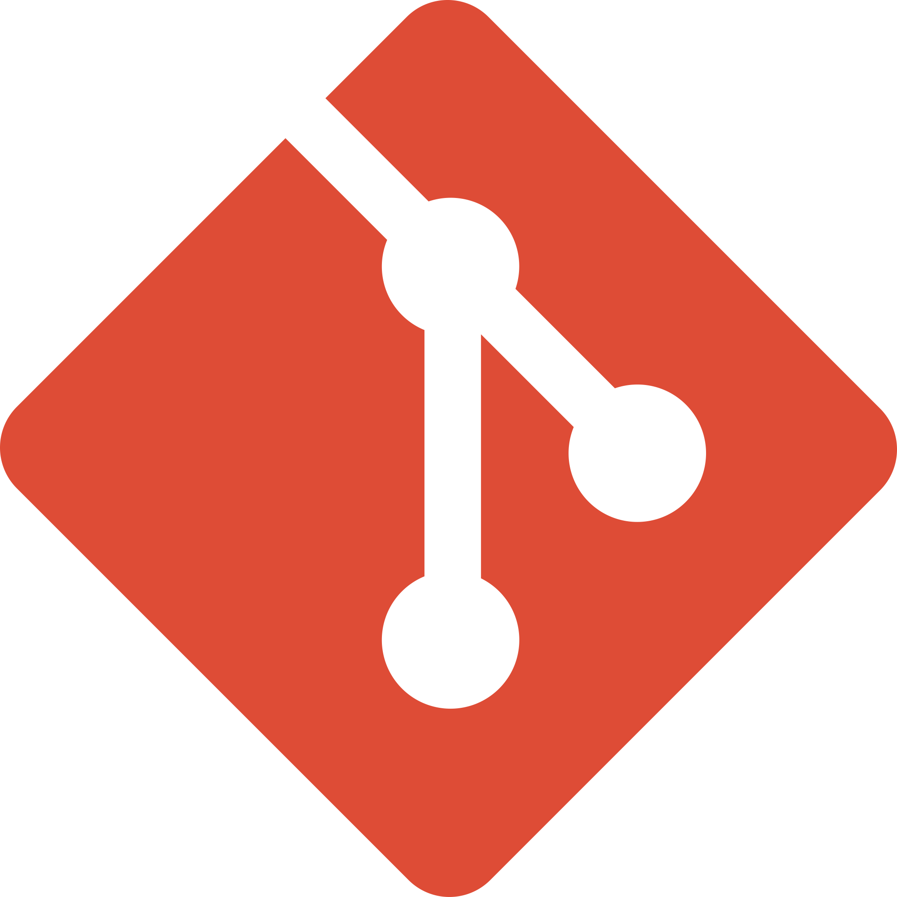

</img>

<h3 align="center">

</h3>

Engenheira de Dados 💻

Clowd AWS

Python & Spark

Comunicativa 🗣 ° Proativa 🧩 ° Visão sitemica ⚙

Faço parte do time de tecnologia e dados. Go Itaú 

 

<h3 align="center">

</h3>

 &nbsp;
 &nbsp;
 &nbsp;
 &nbsp;
 &nbsp;
 &nbsp;
 &nbsp;
 &nbsp;
 &nbsp;
 &nbsp;

 

<table align="center" width="100%">
<row>
    <td>
        
    </td>
    <td>
        
    </td>
</row>

</table>

